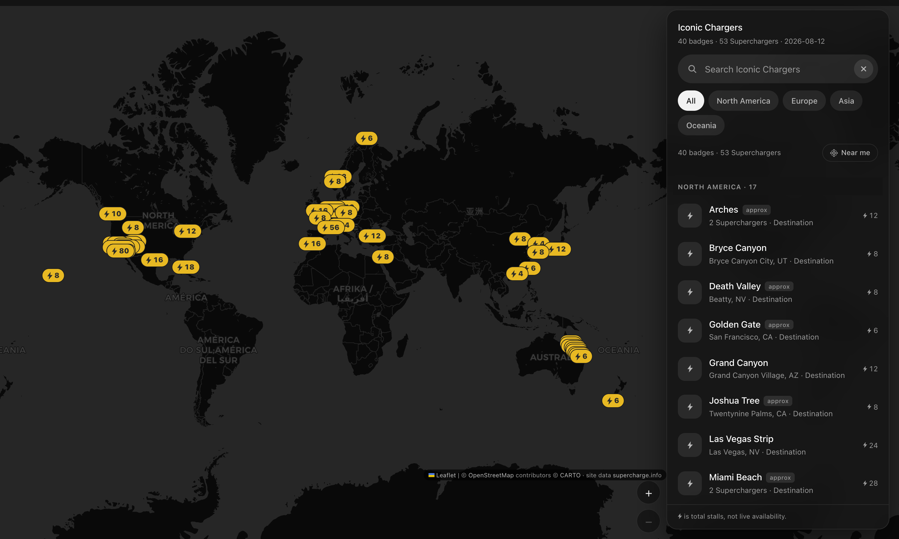
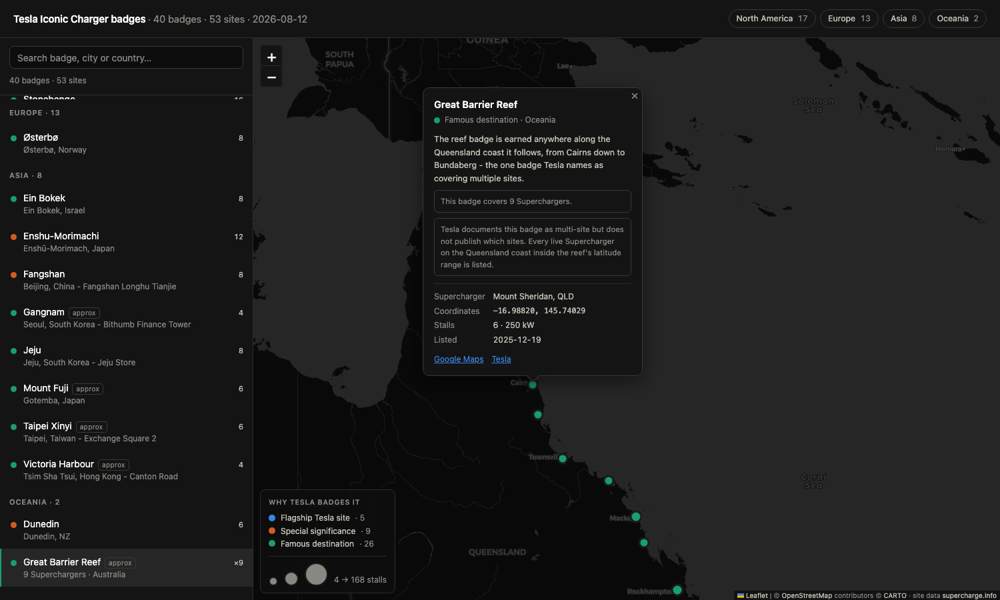

<div align="center">

# ⚡ Iconic Chargers

**Every Supercharger that earns an Iconic Charger badge in the Tesla app — mapped.**

Tesla's Charging Passport hands out a collectable badge for charging at certain Superchargers.
Tesla only publishes that list *inside the app*. This is that list, with real coordinates.

<br>


<br>



</div>

---

## Open it

```sh
git clone https://github.com/LakshmanTurlapati/Iconic-Chargers.git
cd Iconic-Chargers
open web/index.html          # macOS · or just double-click the file
```

No `npm`, no bundler, no server. One HTML file, a generated data file, and a vendored copy of
Leaflet. Only the basemap tiles come off the network, so everything but the map imagery works
offline.

Prefer a server? `python3 -m http.server 8731` → <http://127.0.0.1:8731/web/index.html>.

---

## What counts as "iconic"

Not an opinion — a Tesla feature. From
[Tesla's documentation](https://www.tesla.com/support/tesla-app/charging-badges):

> "Each Iconic Charger badge is tied to specific flagship Supercharger sites such as the Tesla Diner
> or are located by famous destinations including Yosemite National Park."

Badges live under `Charging → Badges` in the Tesla app. This repo covers **Iconic Chargers** only —
not the Charging Milestone or Special Event badges.

### A badge is not always one Supercharger

The single most important detail, quoted from the same page:

> "Some Iconic Charger badges can be earned at multiple sites. For example, charging at any of the
> specified Supercharger sites along the Great Barrier Reef will earn you the corresponding badge."

So the data model is **badge → one or more Superchargers**, never the reverse. Six badges here cover
more than one site: Great Barrier Reef (9), and Arches, Miami Beach, Niagara Falls, Santa Monica and
Whistler (2 each).

---

## The map

| | |
|---|---|
| ⚡ **Markers** | Tesla's own Supercharger marker shape — a capsule with a bolt and a count |
| 🔢 **The number** | **total stalls**, not live availability — see the note below |
| 📋 **Sidebar** | lists **badges**, grouped by region, and doubles as the table view |
| 🎨 **Colour in the list** | why Tesla badges it — flagship · significance · destination |
| 🔗 **Multi-site** | selecting a badge frames **all** its Superchargers at once |
| 🏷️ **Filter** | the four regions |
| 🔎 **Search** | badge name, city, country, or anything in the write-up |
| 🪪 **Deep links** | `web/index.html#Great%20Barrier%20Reef` |

> **The number is capacity, not availability.** Tesla's map shows how many stalls are *free right
> now*; this shows how many the site *has*. Same visual language, different meaning — there is no
> live feed here, and none is implied.

Marker colours are measured, not eyeballed: gold `#e8b923` sits at **9.35:1** over the basemap's
water and **8.03:1** over its land, and the `#2c2c2a` bolt and digits at **7.59:1** against the gold
— past the 4.5:1 bar for text, not just the 3:1 bar for graphics. Swap `--pin-gold` to `#d4af37` for
an antique gold.

<div align="center">

</div>

### Speed

`node scripts/bench.mjs` drives a real drag and wheel-zoom over CDP and reports frame times, tile
counts and load cost. It throttles the CPU 6× by default, because unthrottled on a fast Mac every
interaction already sits at the renderer's ceiling and the run reports no jank whatever the code
does.

Measured at 6× CPU on a simulated 4G connection, against a compressing server:

| | before | after |
|---|--:|--:|
| First contentful paint | 240 ms | **132 ms** |
| Leaflet ready (map can start) | 254 ms | **147 ms** |
| DOM ready | 309 ms | **182 ms** |
| Origins contacted | 6 | **2** |
| Tiles for one badge flight | 230 | **77** |
| Main thread blocked per keystroke | 22.6 ms | **0.5 ms** |

What did it:

- **Leaflet is vendored, not CDN-loaded.** Browsers partition the HTTP cache by site, so a shared
  CDN copy is never reused across sites — the third-party origin bought nothing and cost a DNS + TLS
  round trip that blocked map init. Both files are byte-identical to unpkg's `leaflet@1.9.4`.
- **`{s}` tile sharding removed, one `preconnect` added.** `a`–`d.basemaps.cartocdn.com` are one
  Fastly host behind a wildcard cert, so the browser coalesced them onto a single HTTP/2 connection
  anyway; the shards only ever cost three extra DNS lookups and split the preconnect four ways.
- **`updateWhenZooming: false`.** Flying to a badge crossed every zoom level en route and requested
  a full screen of tiles at each — 230 tiles to show one site, discarded before they could be seen.
- **The map is no longer rebuilt on every keystroke.** Search used to `clearLayers()` and re-add all
  53 markers, destroying and recreating their DOM even when the results were identical; the sidebar
  was re-parsed from `innerHTML` at the same time. Both now update only what changed, coalesced to
  one render per frame.

**Frame rate was never the problem** — drag and zoom dropped zero frames before this work and drop
zero after. The wins above are all in load time and wasted network, not rendering.

### Continuous zoom

Wheel and trackpad zoom is continuous, and settles onto a whole zoom level when you stop.

Leaflet's built-in wheel zoom is off, because it routes through `setView()` — and `setView()`
silently discards any zoom requested while a previous one is still animating
(`_tryAnimatedZoom` returns `true` whether or not it did anything, and `setView` reads that as
"handled"). The animation is a 250 ms CSS transition, so the faster you scrolled the more input was
thrown away: six identical notches moved the map **1 level at 30 ms spacing, 2 at 60 ms and 3 at
200 ms**. Whole-level snapping hid the loss, since each surviving notch jumped a full level — which
is exactly what "stepped" felt like.

In its place is a handler shaped like Leaflet's own pinch-zoom, driving `map._move()` from a
`requestAnimationFrame` loop. `_move` assigns the zoom verbatim without `_limitZoom`, so the gesture
is fractional **while `zoomSnap` stays at 1** — every other view call in the app still lands on a
whole level, unchanged. Tagging the move `{pinch: true}` keeps `updateWhenZooming: false` in force,
so the grid is transformed rather than refetched. Measured across one gesture: **81 distinct zoom
values over 253 frames** (was 3), largest single step 0.39 levels (was a full level), and zero grid
rebuilds.

The settle matters because the basemap is raster: between two levels it is a scaled bitmap. Stopping
eases onto the nearest whole level so it comes to rest sharp. Past a small dead zone a gesture always
commits at least one level, so a single wheel notch can't round back to where it started and do
nothing.

Not tried and rejected: `zoomAnimation: false`. It would route every notch through `_resetView`,
which fires `viewprereset`, which `GridLayer` binds to `_invalidateAll` — **one wheel notch would
delete every tile and rebuild the grid.**

Two changes were tried, measured, and reverted rather than shipped: continuous zoom (`zoomSnap: 0`)
made a wheel notch move a fifth of a level instead of a whole one, and — since these are raster
tiles — left the basemap a scaled bitmap whenever it sat between levels; and a larger `keepBuffer`
changed nothing, because it governs which loaded tiles are *retained*, not which are fetched ahead.

---

## The badges

| Region | Badges | Sites |
|---|--:|--:|
| North America | 17 | 22 |
| Europe | 13 | 13 |
| Asia | 8 | 8 |
| Oceania | 2 | 10 |
| **Total** | **40** | **53** |

**North America** — San Antonio River · Arches · Grand Canyon · Bryce Canyon · Las Vegas Strip ·
Joshua Tree · Miami Beach · Death Valley · Tesla Diner · Santa Monica · Yellowstone · Oasis ·
Yosemite · Niagara Falls · Golden Gate · Whistler · Waikiki

**Europe** — Dombås · Gayrettepe · Gigafactory Berlin · Harderwijk · Hilden · Honningsvåg ·
Lake Garda · Lovosice · Mont Saint-Michel · Montélimar · Østerbø · Sevilla · Stonehenge

**Asia** — Ein Bokek · Enshu-Morimachi · Jeju · Mount Fuji · Fangshan · Gangnam · Taipei Xinyi ·
Victoria Harbour

**Oceania** — Dunedin · Great Barrier Reef

📖 **[Full list with coordinates →](ICONIC-CHARGERS.md)**

---

## Files

| Path | What it is |
|---|---|
| [`web/index.html`](web/index.html) | The map. The entire app. |
| `web/sites.js` | Generated data for the map — don't hand-edit. |
| `web/vendor/` | Leaflet 1.9.4, unmodified. |
| [`ICONIC-CHARGERS.md`](ICONIC-CHARGERS.md) | Every badge, its Superchargers, coordinates. |
| [`data/iconic-badges.json`](data/iconic-badges.json) | Machine-readable: `badges[]` and `sites[]`. |
| [`scripts/build_iconic.py`](scripts/build_iconic.py) | Generates all three from one `BADGES` list. |
| [`scripts/bench.mjs`](scripts/bench.mjs) | Frame times, tile counts and load cost, under throttling. |

### Regenerating

```sh
mkdir -p data
curl -s https://supercharge.info/service/supercharge/allSites -o data/allSites.json
python3 scripts/build_iconic.py
```

`data/allSites.json` is a ~6 MB upstream snapshot and is gitignored — fetch it before building.

The build **fails loudly** if any badge resolves to zero live Superchargers, printing the near-miss
candidates and their status. That matters: `Dombås` is listed upstream as `EXPANDING` rather than
`OPEN`, and a naive "open sites only" filter drops it without a word.

---

## Accuracy, and what's still uncertain

Badge **names** come from the Tesla app on the snapshot date. Badge → Supercharger **mappings** are
resolved here by proximity, because Tesla doesn't publish them. Every mapping carries a `confidence`:

- **`exact`** (26 badges) — the badge name matches the Supercharger's name, or only one live
  Supercharger exists at the landmark.
- **`approx`** (14 badges) — several plausible candidates nearby. Flagged in the JSON, labelled
  `approx` in the sidebar, and footnoted in the Markdown list.

To settle an `approx` one: tap the badge in the Tesla app and select a site to see its real address.

Two are worth calling out:

> **Death Valley has no Supercharger.** `Furnace Creek` is still unbuilt (status `VOTING`, 0 stalls).
> The nearest live site is **Beatty, NV — 51 km outside the park**, which is what's mapped.

> **Great Barrier Reef is multi-site and undocumented.** Tesla names it as the multi-site example but
> never says which Superchargers count. All 9 live Queensland coastal sites in the reef's latitude
> range are listed, which may be broader than Tesla's actual set.

Also note: **Niagara Falls exists only on the Canadian side** — there is no Supercharger at Niagara
Falls, NY.

### Provenance

Coordinates, stall counts, elevations and status come from
[supercharge.info](https://supercharge.info). Coordinates are **WGS84 decimal degrees**.

Cross-checked against OpenStreetMap nodes where the upstream data carries an `osmId`: **22 of 53
sites verified, worst disagreement 65 m** (Gayrettepe, a multi-level city site). The remaining 31 have
no usable OSM node — mostly newer and non-European sites.

### Known gap

A public Tesla badge grid from **10 December 2025** also showed `Shanghai`, `Chongqing`, `Hangzhou`
and a `Chinese Province` collection badge. None appear in the app list this repo was built from —
most likely China-market badges that aren't visible from a non-China account. They are **not**
included here, and this list should not be read as Tesla's global total.

Tesla adds badges silently and in-app only, so treat this as a **snapshot**, not a live feed.

---

<div align="center">
<sub>

Basemap © [OpenStreetMap](https://www.openstreetmap.org/copyright) contributors, © [CARTO](https://carto.com/attributions) ·
Site data © [supercharge.info](https://supercharge.info) · Badge list read from the Tesla app · Snapshot 2026-08-12

Not affiliated with, endorsed by, or sponsored by Tesla, Inc.

</sub>
</div>
