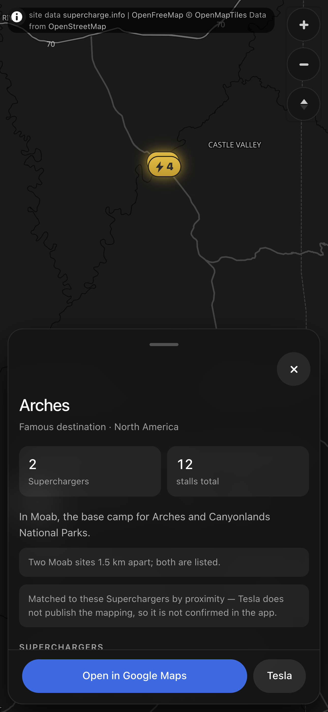
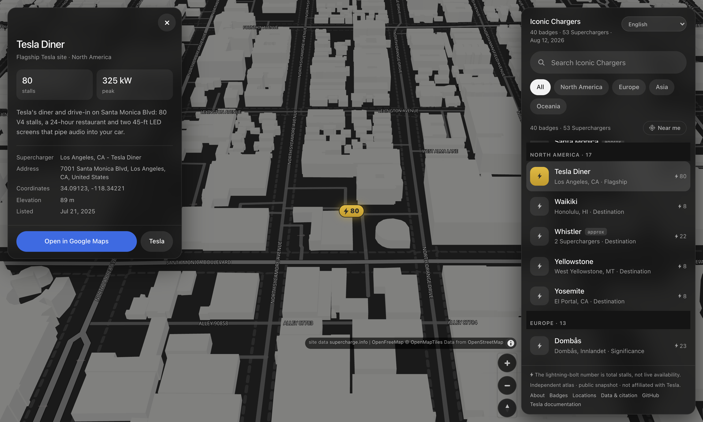

<div align="center">

# ⚡ Iconic Chargers

**An independent atlas of Tesla Charging Passport Iconic Charger badge locations.**

Tesla's Charging Passport awards collectible badges for charging at certain Superchargers. Iconic
Chargers is Lakshman Turlapati's public, downloadable snapshot of those badges, the sites believed to
earn them, and the evidence and confidence behind each mapping. It is not affiliated with Tesla and
is not a live charger-availability service.

**Canonical site: [iconicchargers.com](https://iconicchargers.com/)**

<br>


<br>


</div>

---

## Open it

Use the production atlas at **[https://iconicchargers.com/](https://iconicchargers.com/)**. Badge,
location, methodology and download pages are server-rendered and crawlable; the homepage remains
the full interactive map.

The source map also still works directly from disk:

```sh
git clone https://github.com/LakshmanTurlapati/Iconic-Chargers.git
cd Iconic-Chargers
open web/index.html          # macOS · or just double-click the file
```

No `npm`, no bundler, no server. The page loads local classic scripts for charger data, all locale
catalogs, MapLibre GL JS, and its lazily initialized RTL text plugin, so `file://` startup needs no
module fetches. OpenFreeMap supplies the vector style, glyphs and tiles; the charger list and details
remain usable if those are offline. The interactive map requires WebGL. OpenFreeMap needs no key or
registration, but does not provide an availability SLA.

Prefer a server? `python3 -m http.server 8731` → <http://127.0.0.1:8731/web/index.html>.

### Languages and automatic selection

The complete interface, accessibility copy, badge descriptions and notes are available in 18
locales: English, French, German, Dutch, Norwegian Bokmål, Norwegian Nynorsk, Italian, Spanish,
Turkish, Czech, Hebrew, Arabic, Japanese, Korean, Simplified Chinese, Traditional Chinese,
Cantonese and Māori. The compact selector in the header shows each language by its native name.
Arabic and Hebrew switch the whole shell to RTL while canonical place names, addresses and
coordinates keep their own direction.

Language selection is deliberately progressive:

1. A saved choice in `localStorage["iconic.locale.v1"]` wins.
2. Otherwise the best supported `navigator.languages` match renders immediately.
3. In **Automatic** mode only, a non-blocking country lookup may refine that choice to a language
   used in the detected country. A browser language valid for the country wins; otherwise the
   country's default is used. Unmapped countries retain the browser match.
4. English is the final fallback.

Choosing **Automatic** clears the saved override and runs that process again. Switching happens in
place: camera, filters, query, selection, list/detail scroll, focus and Near Me ordering stay put.
Search is Unicode- and accent-insensitive and indexes both localized copy and the canonical English
source, so either vocabulary continues to work. Map place labels request the selected
OpenStreetMap-language field, falling back to the local name and then English when coverage is
missing.

On the canonical site, English uses `/` and each explicit locale uses `/{locale}/`. The URL locale
wins over saved or browser language, and changing the selector replaces only that path while
preserving the query, badge hash and live map state. Direct `file://` use retains the automatic
selection flow above.

Automatic mode calls only [`https://api.country.is/`](https://country.is/), with no credentials or referrer and a
1.5-second abort timeout. Only a validated two-letter country code is retained, for six hours in
`sessionStorage`; the returned IP is discarded. There is no second provider, and a blocked, slow,
offline or malformed response silently leaves the immediate browser-language result intact. The
service is keyless and describes itself as non-logging, but has no availability SLA; VPNs and IP
location can also be wrong. This is only a default because, as the
[W3C notes](https://www.w3.org/International/questions/qa-site-conneg.en.html), physical location
does not reliably identify reading language.

Units follow detected country rather than UI language: a US result uses miles and every other
country uses kilometres. If lookup fails, `en-US` retains the previous miles fallback. Changing the
language selector never changes units. Automatic language detection does **not** request browser
geolocation; the existing Near Me button remains the only precise-location permission flow.

---

## What counts as "iconic"

Not an opinion — a Tesla feature. From
[Tesla's documentation](https://www.tesla.com/support/tesla-app/charging-badges):

> "Each Iconic Charger badge is tied to specific flagship Supercharger sites such as the Tesla Diner
> or are located by famous destinations including Yosemite National Park."

Badges live under `Charging → Badges` in the Tesla app. This repo covers **Iconic Chargers** only —
not the Charging Milestone or Special Event badges.

### A badge is not always one Supercharger

The single most important detail, quoted from the same page:

> "Some Iconic Charger badges can be earned at multiple sites. For example, charging at any of the
> specified Supercharger sites along the Great Barrier Reef will earn you the corresponding badge."

So the data model is **badge → one or more Superchargers**, never the reverse. Six badges here cover
more than one site: Great Barrier Reef (9), and Arches, Miami Beach, Niagara Falls, Santa Monica and
Whistler (2 each).

---

## The map

| | |
|---|---|
| ⚡ **Markers** | Tesla's own Supercharger marker shape — a capsule with a bolt and a count |
| 🔢 **The number** | **total stalls**, not live availability — see the note below |
| 🏙️ **3D pipeline** | altitude-driven pitch and OpenStreetMap extrusions appear at z15+; the camera is capped at z19 |
| 🧭 **Compass** | rotate the map, then tap the pitch-aware compass to return north |
| 🔎 **Search** | badge name, Supercharger name, city, country, why it's badged, or anything in the write-up |
| 🏷️ **Filter** | `All` plus the four regions, additive |
| 📍 **Near me** | opt-in — sorts by distance to each badge's *nearest* Supercharger |
| 🪪 **Detail card** | opens opposite the list — stats, why, every Supercharger, coordinates, links. `×` or `Esc` closes |
| 🔗 **Multi-site** | selecting a badge frames **all** its Superchargers at once |
| 🔖 **Deep links** | `web/index.html#Great%20Barrier%20Reef` |

> **The number is capacity, not availability.** Tesla's map shows how many stalls are *free right
> now*; this shows how many the site *has*. Same visual language, different meaning — there is no
> live feed here, and none is implied.

Marker colours are measured, not eyeballed. The capsule is an antique gold lit from above —
`#e0bb45` to `#c09a2e` — because a flat fill reads as a sticker rather than an object. The
`#2c2c2a` bolt and digits have to clear 4.5:1 against the **darkest** end of that gradient, not its
average, which is the value that actually constrains it: **5.27:1** at the bottom, **7.57:1** at the
top.

Against the basemap, again quoted at the darkest end: **7.5:1** over water, **6.6:1** over land,
**5.1:1** over a building footprint, **3.6:1** over a minor road. Two backdrops the gold cannot
carry alone are **2.0:1** on a motorway and **1.66:1** on a `#787876` extrusion. The pin's 1.5px
`#1b1b1b` ring carries separation in both cases, at **3.28:1** and **3.89:1**, so the boundary
remains distinct where the gold alone cannot carry it.

### A legible dark basemap

OpenFreeMap's `dark` style is not merely dim — its hierarchy is inverted in three places, which is
why the stock map reads as an empty black field:

| | Upstream | Problem |
|---|---|---|
| `building` | `rgb(10,10,10)` on a `rgb(12,12,12)` background | **darker than the land it sits on**; only its outline shows |
| `highway_motorway_inner` | `#000` from z6 up | the most important road class is pure black, painted *over* a lighter `#3c3c3c` casing, so a motorway reads as two thin edges around a gap |
| `highway_major_inner` | `#121212` | **darker than `highway_minor`'s `#181818`** — the ranking runs backwards |

Plus black text on `water_name`, and ~2.4:1 street labels.

`dark` is OpenFreeMap's only dark style, so overriding its paint is the alternative to adding a
second tile provider, not merely the tidier option. In its place is one achromatic ramp where
lightness tracks importance, quoted as contrast against the `#1a1a1a` land:

| | | vs land |
|---|---|--:|
| water | `#0a0a0a` | darker than land — the conventional cue, and what makes a coastline read |
| buildings | `#2e2e2e`, extruded `#787876` | **1.28:1** flat |
| minor roads | `#454545` | **1.81:1** |
| major roads | `#585858` | **2.45:1** |
| motorways | `#6c6c6c` | **3.31:1** |
| place labels | `#c2c2c2` | **9.8:1** |

Casings invert too, from `rgba(60,60,60,0.8)` to `#0f0f0f` — *darker* than the land. Upstream the
casing is lighter than the inner it wraps, which is precisely what produces the hollow-black-road
effect; a dark casing makes each road read as a ribbon with a crisp edge.

Applied with `setPaintProperty` on `style.load`, so it survives a restyle, and guarded by
`getLayer` so an upstream rename degrades to the stock colour instead of throwing. All 59 overrides
cost **1.3 ms once** at 6× CPU throttle, and nothing per frame — they change shader constants, not
the number of draw calls.

### Styled after Tesla's navigation UI

The map is the substrate — full-bleed, edge to edge — and everything else floats on it as rounded,
blurred cards, the way the car does it. Search sits on the **right**; picking a badge opens a detail
card **opposite it, on the left**, so the list keeps its place and its scroll position instead of
being swapped out from under you. On a phone both become draggable sheets — see
[On a phone](#on-a-phone).

Three things that reading Tesla's actual conventions changed:

- **Achromatic, with one reserved accent.** Tesla's UI is white/grey/black everywhere except the
  primary action, which is Tesla Blue `#3e6ae1`. The list used to carry three saturated colours for
  *why* a site is badged; that is plain text now, so identity is never colour-alone. The ratios
  agree with the convention, which is what settles how the blue may be used: `#3e6ae1` on the panel
  is **3.9:1** — fine for a focus ring, short of the 4.5:1 text needs — while white *on* the blue is
  **4.8:1**. So the accent is only ever a fill or a ring, and there are no blue links in the file.
- **No webfont.** Tesla ships Universal Sans across car, app and site, and it is proprietary. Rather
  than pay a round trip on the critical path for a lookalike, this uses Tesla's own declared
  fallback stack and takes the resemblance from weight and spacing instead — 500 where a dashboard
  would reach for 600, and considerably more air.
- **`All` is a state, not a shortcut.** Every region ticked and no filter at all select the same
  badges, but they should not *look* alike. Lighting all five chips on load made the selected style
  carry no information; `All` is the resting state now, and region chips only light up once a real
  subset is chosen.

Both cards are siblings of the map container, never children and never map controls. A wheel over a
sibling bubbles to `<body>` instead of the WebGL canvas, so either card scrolls without zooming the
map. Everything the app frames — the initial fit, a badge, a single Supercharger — is padded for
whichever cards are actually on screen, so a selected site lands in the gap between them and never
underneath one. The card therefore has to be *opened before* the padding is measured; opening it
when the flight lands measures a card that is still hidden and flies the site to the spot it is
about to cover.

The initial all-sites camera is also the zoom-out floor: the complete atlas remains visible, but
there is no extra pull-back into empty world space. That floor is recalculated from the resting list
geometry when the viewport changes, always using all 53 sites rather than the active filters, detail
card, or current sheet detent. Resizing while parked at the overview reframes it; zoomed-in and
selected cameras stay put unless a newly higher floor must clamp them. On portrait screens the
Mercator world may be shorter than the canvas, so it is kept fully on-canvas and placed in the usable
band above the bottom sheet.

<div align="center">

</div>

### On a phone

There are **three** layouts, not two. The breakpoints live in the stylesheet and are mirrored
exactly once in JS, because deriving the mode from `innerWidth` in parallel is how the two drift
apart:

| | Layout |
|---|---|
| wider than 820px | **desktop** — cards docked right and left |
| ≤ 820px, taller than 500px | **sheet** — draggable bottom sheet |
| ≤ 820px, 500px or shorter | **side** — landscape phone: dock to the right edge |

The third exists because a landscape phone is under 820px wide and so used to get the bottom sheet,
which left a 115px strip of map — and with the detail card open, asked `cameraForBounds` for **333px
of padding inside 375px of viewport**, which is not a camera. It docks to the right instead, and the
detail card overlays it rather than taking the opposite edge: two 340px cards on a 667px screen
would leave 23px of map between them.

**The sheet has three detents**, and the interesting one is FULL. It is bounded by the *control
column*, measured live, rather than by a percentage — which makes "the zoom buttons and the
attribution are reachable" true at every detent by construction rather than by a passing test. That
matters because the attribution is a licence requirement, and the first version of this layout hid
it behind the sheet. On a 430×900 phone the three land at **147 / 434 / 720px**. PEEK is measured
from where the search field actually ended up, since the header wraps differently at every width.

Dragging moves the sheet with a `transform` and the resting state is a real `height`. Both halves
are load-bearing: animating height reflows the scroll container every frame, while a resting
transform hangs `.dfoot` — and its primary action — below the bottom of the screen. So the layout
height is held at the taller of the two for the duration and swapped back on `transitionend`. It has
to be the *taller*: a negative offset does not collapse a bottom-anchored card, it lifts the whole
card off the bottom edge, and going 720 → 147 that way sent the sheet flying up the screen and back
instead of sliding down. A throw goes to the next detent along rather than the nearest one, which is
the difference between flicking a sheet and nudging it. Tapping the grabber cycles the same detents,
so none of this requires a drag you can perform.

Pulling down from the top of the list collapses the sheet too, and that gesture needs a *non-passive*
`touchmove` on the scroll container — pointer events cannot express it, because the browser owns
vertical panning inside a scroller and cancels the pointer stream the moment it decides to scroll.
Non-passive means scrolling can no longer be handled entirely off the main thread, which is worth
checking rather than assuming: at 6× CPU throttle, scrolling the list measured **p95 15.9ms with
zero janky frames**, against 16.1ms and zero for the same scroll with the handler bailing out early.
It costs nothing. Dragging does drop the sheet's `backdrop-filter` for the duration, though, since
re-compositing a blur of the live map every frame is the one thing here expensive enough to matter —
and the opaque fallback already exists for browsers without `backdrop-filter`.

Six defects that only exist on a touch device, each of which was in the previous "responsive"
layout:

- **The page zoomed in on search and never zoomed back.** iOS magnifies the whole page whenever a
  focused input is under 16px. The field was 15px.
- **Tapping a pin stranded its name label over the map.** A touchscreen applies `:hover` on tap and
  keeps it until you tap elsewhere, so every hover rule here is now behind `@media (hover: hover)`.
  Gating changes nothing on a mouse — that is what `hover: hover` means — and a media query alters
  neither specificity nor source order, so the rules are wrapped *in place* rather than collected.
- **The sheet sat under the home indicator**, with no `viewport-fit=cover` and no
  `env(safe-area-inset-*)`. Without `cover` the insets all report 0, so one is useless without the
  other.
- **The keyboard covered the list you were typing to filter.** iOS does not shrink the layout
  viewport when it opens; `visualViewport` is the only surface that reports it.
- **Five controls under the 44px touch floor** — 34, 30, 38, 32 and 40. Two are still smaller by
  design and both are named in the check rather than hidden by a loose threshold: `#clear` is 40
  because it sits inside a 48px field, and MapLibre's attribution links are 12px vendor text.
- **`64vh`/`76vh` drifted** as the URL bar collapsed. The detents are measured against
  `visualViewport` now, and `100dvh` backs the page height.

Two hit boxes are deliberately larger than the things they draw, since a 24px capsule and a 28px
handle are not thumb-sized: the pin grows to **61 × 48** and the grabber to a 44px band, both via a
pseudo-element so the drawn shape is untouched. The grabber grows *downward* into the header
padding — growing upward reads better, but the sheet is `overflow: hidden` for its rounded corners,
so anything above the top edge is clipped and the target measured 36px.

**Never set `position` on `.pin`.** That element *is* the MapLibre marker — it carries
`class="pin maplibregl-marker …"` — and MapLibre positions markers with
`.maplibregl-marker { position: absolute }` at the same `(0,1,0)` specificity. This stylesheet loads
after the vendor one, so anything declared here wins: a `position: relative` added to anchor the
pseudo-element above dropped all 53 markers into normal document flow, and MapLibre's transform then
offset each from wherever it landed. 52 of 53 pins ended up misplaced, the worst by 1,248px, on
touch devices only. Nothing was needed — an absolutely positioned element is already a containing
block for an absolutely positioned pseudo-element. `verify.mjs` now checks every marker's rendered
position against `map.project(marker.getLngLat())` in both pointer modes, which is the one thing the
suite could not see before: every other geometry check projects *both* sides, so it compares where a
pin should be against where a card is, and never against the pin actually on screen.

Framing gained the clamp it never had. Padding is measured from a card's leading *edge* to the far
side of the viewport rather than from its own height, because a sheet mid-drag hangs below the
viewport; and the total is scaled back so at least 30% of the canvas survives. At the tallest detent
the raw ask reaches **82%** of the viewport and clamps to 70%. On desktop the widest ask is 436px of
1500px, so the factors are exactly 1 and the returned padding is byte-identical to before.

<div align="center">

</div>

### Altitude-driven 3D

The map stays north-up and flat while the camera is at least **1,000 m** above the vector-map plane.
Below that, it eases from 0° to 50° of pitch over one zoom level — approximately 1,000 m to 500 m —
and reverses the same curve when zooming out. The cutoff is calculated from camera altitude for the
current latitude and viewport rather than hard-coded to one zoom number.

The cutoff target is computed from the same
`calculateCameraOptionsFromCameraLngLatAltRotation` call the pitch rule itself uses, at a flat
1,000 m rather than the site's own elevation, because that rule reads *terrain* elevation and there
is no DEM attached. Feeding it anything else would aim past its own cutoff instead of at it.

A map pin always names one Supercharger, while a multi-site badge can name up to nine spread over
hundreds of kilometres. Both are framed within the same z19 camera ceiling.

The user camera is capped at **z19**. OpenFreeMap's OpenMapTiles source currently ends at **z14**;
those vector tiles continue to overzoom normally, so the source limit is not the camera limit. The
extra range is what allows the altitude transition, 50° selection pitch and z15–16 building reveal
to be used in the product.

Buildings appear at z15 and rise smoothly to their full OpenStreetMap-derived `render_height` and
`render_min_height` by z16, avoiding a hard 3D pop. Their opaque muted-gray material is subtly
direction-lit: adjacent roofs and walls receive a restrained achromatic tonal shift that makes edges
readable without introducing coloured faces, outlines, transparency, or height-based shading. The
viewport-anchored cue remains visually consistent as the map rotates, and the layer remains below
road and place labels. Coverage and height quality therefore vary with OpenStreetMap. This is a
building view, not terrain: “surface” means the nominal map plane, with no elevation model or
satellite layer. Pitch gestures are disabled so the altitude rule stays deterministic; bearing
rotation remains available, with the compass returning the map to north.

<div align="center">

</div>

### Speed

`node scripts/bench.mjs` drives real drag and wheel input, measures the WebGL frame cadence, counts
OpenFreeMap resources and reports the country request separately. It throttles the CPU 6× by default
so interaction regressions show up instead of disappearing inside a fast development Mac.

A three-run cold-cache baseline at 6× CPU on simulated 4G:

| Metric | Median |
|---|--:|
| First contentful paint | 288 ms |
| Local MapLibre bundle ready | 1.14 s |
| DOM ready | 1.23 s |
| Complete first vector style | 2.61 s |
| Initial vector tiles | 15 |
| Initial transferred resources | 1.14 MB |
| Drag / zoom frame p95 | 9.4 ms / 9.3 ms |
| Frames over 20 ms during drag / zoom | 0 / 0 |
| Five search updates, synchronous work | 0.5 ms |

The vector renderer is deliberately heavier than the former raster map: it pays for the GL runtime,
style, glyphs and decoded geometry before the first complete map. Automatic mode adds
`api.country.is` as the only additional origin; a saved language choice skips that request. The map
still reuses the style's single vector source for 3D, so the building layer does not duplicate tile
downloads. Search continues to reconcile only changed markers and persistent list rows.

### Continuous zoom

MapLibre handles wheel and trackpad input natively, keeps the cursor anchored, and leaves the camera
at a fractional zoom when the gesture ends. Vector geometry stays sharp there, so the raster-era
whole-level settle is gone. The discrete-wheel rate is tuned so six ordinary notches move about
three zoom levels while a trackpad keeps its finer native response. The same continuous camera path
drives the 1 km pitch transition, so zoom and 3D do not fight separate animation loops or private
renderer APIs.

---

## The badges

| Region | Badges | Sites |
|---|--:|--:|
| North America | 17 | 22 |
| Europe | 13 | 13 |
| Asia | 8 | 8 |
| Oceania | 2 | 10 |
| **Total** | **40** | **53** |

**North America** — San Antonio River · Arches · Grand Canyon · Bryce Canyon · Las Vegas Strip ·
Joshua Tree · Miami Beach · Death Valley · Tesla Diner · Santa Monica · Yellowstone · Oasis ·
Yosemite · Niagara Falls · Golden Gate · Whistler · Waikiki

**Europe** — Dombås · Gayrettepe · Gigafactory Berlin · Harderwijk · Hilden · Honningsvåg ·
Lake Garda · Lovosice · Mont Saint-Michel · Montélimar · Østerbø · Sevilla · Stonehenge

**Asia** — Ein Bokek · Enshu-Morimachi · Jeju · Mount Fuji · Fangshan · Gangnam · Taipei Xinyi ·
Victoria Harbour

**Oceania** — Dunedin · Great Barrier Reef

📖 **[Full list with coordinates →](ICONIC-CHARGERS.md)**

---

## Files

| Path | What it is |
|---|---|
| [`web/index.html`](web/index.html) | The map. The entire app. |
| `web/sites.js` | Generated data for the map — don't hand-edit. |
| [`web/locales.js`](web/locales.js) | One classic-script catalog containing all 18 locales for `file://` startup. |
| `web/vendor/` | MapLibre GL JS 5.24.0 and the lazy RTL text plugin, with their licences. |
| `web/og.png` | The 1200×630 social sharing card. |
| [`ICONIC-CHARGERS.md`](ICONIC-CHARGERS.md) | Every badge, its Superchargers, coordinates. |
| [`data/iconic-badges.json`](data/iconic-badges.json) | Machine-readable: `badges[]` and `sites[]`. |
| [`scripts/build_iconic.py`](scripts/build_iconic.py) | Generates all three from one `BADGES` list. |
| `scripts/build_site.mjs` | Deterministically generates the localized crawlable site and canonical feeds into `.site/`. |
| `scripts/verify_site_output.mjs` | Cross-checks HTML, feeds, URLs, metadata, alternates and entity counts. |
| [`scripts/verify_site_browser.mjs`](scripts/verify_site_browser.mjs) | Browser smoke test for generated locale paths, deep links, metadata and preserved map state. |
| [`scripts/bench.mjs`](scripts/bench.mjs) | Frame times, tile counts and load cost, under throttling. |
| [`scripts/verify.mjs`](scripts/verify.mjs) | CDP checks for product flows, all locales, IP/storage scenarios, RTL, responsive layout and `file://`. |
| [`scripts/verify_i18n.mjs`](scripts/verify_i18n.mjs) | Static catalog, placeholder, plural, editorial-copy and resolver validation. |
| [`scripts/shots.mjs`](scripts/shots.mjs) | Regenerates the deterministic English world, detail and phone screenshots. |
| [`CITATION.cff`](CITATION.cff) | Citation metadata for the dated public snapshot. |
| [`DATA-RIGHTS.md`](DATA-RIGHTS.md) | CC BY 4.0 scope and upstream-data exclusions. |
| [`Dockerfile`](Dockerfile), [`fly.toml`](fly.toml) | Reproducible nginx image and Fly.io runtime configuration. |

`node scripts/shots.mjs --i18n-qa` also writes wide and narrow review images for French, German,
Arabic, Hebrew, Japanese, both Chinese scripts, Cantonese and Māori to `.context/i18n-qa/`.

### Regenerating

```sh
mkdir -p data
curl -s https://supercharge.info/service/supercharge/allSites -o data/allSites.json
python3 scripts/build_iconic.py
```

`data/allSites.json` is a ~6 MB upstream snapshot and is gitignored — fetch it before building.

The build **fails loudly** if any badge resolves to zero live Superchargers, printing the near-miss
candidates and their status. That matters: `Dombås` is listed upstream as `EXPANDING` rather than
`OPEN`, and a naive "open sites only" filter drops it without a word.

### Generating and verifying the published site

```sh
node scripts/build_site.mjs
node scripts/verify_site_output.mjs
```

Generation writes only to the ignored `.site/` directory. It produces the English map at `/`, one
map entry point per explicit locale, localized badge and location directories, 720 badge pages, 954
location pages, localized About and Data pages, four canonical English downloads, a sitemap with
reciprocal language alternates, crawler policy, `llms.txt`, `llms-full.txt`, metadata and real 404
content. English slugs and Supercharge.info site IDs remain stable across languages.

The production image builds that directory in Node Alpine and serves it with nginx Alpine on port
8080. [`fly.toml`](fly.toml) keeps one 256 MB shared-CPU Machine warm in `ord`; the GitHub Actions
workflow runs the complete verification gate before deploying accepted changes to `main` and then
submitting canonical URLs through IndexNow.

`robots.txt` allows ordinary search and user-requested retrieval crawlers while blocking dedicated
or general model-training crawlers. It contains only crawler policy and the absolute sitemap
pointer; entity records live in HTML, the sitemap and downloads. `llms.txt` is a supplementary
resource index, not a substitute for crawlable pages. These measures improve discovery and citation
eligibility, but no search engine or language model is guaranteed to index or cite the project.

---

## Accuracy, and what's still uncertain

Badge **names** come from the Tesla app on the snapshot date. Badge → Supercharger **mappings** are
resolved here by proximity, because Tesla doesn't publish them. Every mapping carries a `confidence`:

- **`exact`** (26 badges) — the badge name matches the Supercharger's name, or only one live
  Supercharger exists at the landmark.
- **`approx`** (14 badges) — several plausible candidates nearby. Flagged in the JSON, labelled
  `approx` in the list and on the detail card, and footnoted in the Markdown list.

To settle an `approx` one: tap the badge in the Tesla app and select a site to see its real address.

Two are worth calling out:

> **Death Valley has no Supercharger.** `Furnace Creek` is still unbuilt (status `VOTING`, 0 stalls).
> The nearest live site is **Beatty, NV — 51 km outside the park**, which is what's mapped.

> **Great Barrier Reef is multi-site and undocumented.** Tesla names it as the multi-site example but
> never says which Superchargers count. All 9 live Queensland coastal sites in the reef's latitude
> range are listed, which may be broader than Tesla's actual set.

Also note: **Niagara Falls exists only on the Canadian side** — there is no Supercharger at Niagara
Falls, NY.

### Provenance

Coordinates, stall counts, elevations and status come from
[supercharge.info](https://supercharge.info). Coordinates are **WGS84 decimal degrees**.

Cross-checked against OpenStreetMap nodes where the upstream data carries an `osmId`: **22 of 53
sites verified, worst disagreement 65 m** (Gayrettepe, a multi-level city site). The remaining 31 have
no usable OSM node — mostly newer and non-European sites.

### Downloads, citation and rights

The canonical English feeds are published at:

- [`/data/iconic-badges.json`](https://iconicchargers.com/data/iconic-badges.json)
- [`/data/locations.json`](https://iconicchargers.com/data/locations.json)
- [`/data/locations.csv`](https://iconicchargers.com/data/locations.csv)
- [`/data/locations.geojson`](https://iconicchargers.com/data/locations.geojson)

Each location record carries its stable source ID and site facts plus the related badge's
confidence, reason, description, notes, page URLs and snapshot date. The preferred citation is:

> Turlapati, Lakshman. *Iconic Chargers: Tesla Iconic Charger Badges and Supercharger Sites.*
> Snapshot 2026-08-12. https://iconicchargers.com/data/.

Lakshman Turlapati's original mappings, selection and editorial text are available under
[CC BY 4.0](https://creativecommons.org/licenses/by/4.0/). That grant does **not** cover upstream
Supercharge.info facts, Tesla names or trademarks, OpenStreetMap/OpenFreeMap basemap data, or other
third-party material. See [`DATA-RIGHTS.md`](DATA-RIGHTS.md) and [`CITATION.cff`](CITATION.cff) for
the precise scope and machine-readable citation details.

### Known gap

A public Tesla badge grid from **10 December 2025** also showed `Shanghai`, `Chongqing`, `Hangzhou`
and a `Chinese Province` collection badge. None appear in the app list this repo was built from —
most likely China-market badges that aren't visible from a non-China account. They are **not**
included here, and this list should not be read as Tesla's global total.

Tesla adds badges silently and in-app only, so treat this as a **snapshot**, not a live feed.

---

<div align="center">
<sub>

Basemap © [OpenStreetMap](https://www.openstreetmap.org/copyright) contributors via [OpenFreeMap](https://openfreemap.org/) ·
Site data © [supercharge.info](https://supercharge.info) · Badge list read from the Tesla app · Snapshot 2026-08-12

Not affiliated with, endorsed by, or sponsored by Tesla, Inc.

</sub>
</div>
